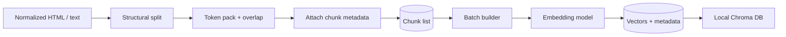

# Chunking & Embedding Architecture

This document specifies **how** normalized HTML from the ingest pipeline is turned into **searchable vector records**. It complements the system view in [rag-architecture.md](./rag-architecture.md) and assumes the **scheduler + scraping** flow (including [GitHub Actions–based scheduling](./rag-architecture.md#40-scheduler-and-scraping-service)) has already produced **per-URL normalized text or DOM-ready content**.

---

## 1. Role in the pipeline

| Stage | Input | Output |
|-------|--------|--------|
| Upstream | Raw HTML from scraping service | Normalized document: main content text/DOM + `source_url`, `scheme_*`, `fetched_at`, document-level `content_hash` |
| **Implemented bridge** | `data/raw/<run_id>/*.html` | Phase **4.1** writes `data/normalized/<run_id>/<scheme_id>.txt` (from Groww `__NEXT_DATA__` / mfServerSideData) plus `scheme_facts.json` — chunking can consume the `.txt` files directly. |
| **Phase 4.2 output** | `data/normalized/<run_id>/*.txt` | `ingest/phases/phase_4_2_chunk_embedding/` writes `data/chunked/<run_id>/chunks.jsonl` (metadata + `chunk_text`) and `embeddings.jsonl` (`BAAI/bge-small-en-v1.5` via sentence-transformers, 384-dim). |
| **Phase 4.3** | `chunks.jsonl` + `embeddings.jsonl` | **Local Chroma** collection upsert via `chromadb` **`PersistentClient`** (`INGEST_CHROMA_DIR`); see **§9**. |
| **Chunking (this doc)** | Normalized document | Ordered list of **chunks**, each with text + metadata |
| **Embedding (this doc)** | Chunk text (+ optional embed prefix) | Fixed-dimension **vectors** |
| Downstream | Vectors + metadata | **Local Chroma** upsert + index manifest; document registry (see [rag-architecture.md](./rag-architecture.md) §4.3) |

---

## 2. Design goals

1. **Retrieval quality for MF FAQs:** Numbers (expense ratio, exit load, min SIP) and labels must stay **co-located** with their table rows or adjacent sentences—avoid splitting mid-row or mid-sentence where possible.
2. **Stable citations:** Every chunk carries **`source_url`** (and scheme fields) so the generator can cite **exactly one** URL per answer.
3. **Reproducibility:** **Embedding model id** and **chunking parameters** are versioned (constants in code or config file committed to the repo). Changing them requires a **full re-embed** or a documented migration.
4. **Efficient daily runs:** Recompute **chunk text hashes**; **re-embed only** chunks whose text changed (optional but recommended for API cost).

---

## 3. Chunking architecture

### 3.1 Preconditions

Chunking runs **after** normalize:

- Boilerplate (nav, cookie banners, footers) removed or excluded from the text stream.
- A single **logical document** per allowlisted URL per run (one Groww scheme page = one document).
- Document-level fields available: `source_url`, `source_type` (e.g. `groww_scheme_page`), `scheme_name` / `scheme_id`, `amc`, `fetched_at`, `content_hash` (hash of normalized full text or canonical HTML).

### 3.2 Structural segmentation (HTML)

Operate on a **DOM** or an equivalent parse tree (e.g. BeautifulSoup, lxml, Readability + DOM):

1. **Heading-driven sections:** Walk the main content in document order. Start a new **section** at each heading (`h1`–`h6`). Attach `section_title` = heading text (trimmed).
2. **Tables:** Treat each `<table>` as an **atomic unit** for the first pass:
   - Serialize to **plain text** preserving row/column order (e.g. TSV-like lines or `Key: Value` per cell pair if the table is two-column).
   - If the serialized table exceeds the max token budget (§3.4), split **by row groups** (e.g. chunks of N rows) while keeping the table header repeated in each chunk for context.
3. **Lists:** Keep `<ul>`/`<ol>` blocks inside the same section as the parent heading unless the list is enormous; then split on top-level `<li>` boundaries.
4. **Inline noise:** Strip scripts, styles, SVG alt noise; keep link text only if it carries meaning (otherwise drop).

### 3.3 Tokenization and counting

- Use the **same tokenizer** the embedding model expects for **length checks**.
- **Current model (`BAAI/bge-small-en-v1.5`):** Uses a BERT-based **WordPiece** tokenizer. Load via `transformers.AutoTokenizer.from_pretrained("BAAI/bge-small-en-v1.5")` and count tokens for length checks; **do not** use `tiktoken` (that is OpenAI-specific).
- **Do not** rely on whitespace word count for limits; MF pages are token-dense (numbers, symbols).

### 3.4 Token packing (fixed target size + overlap)

After structural units are collected in order:

| Parameter | Recommended starting range | Notes |
|-----------|----------------------------|--------|
| `target_tokens` | **400** | Stay well below model **max 512** tokens; smaller chunks improve precision for specific facts. |
| `max_tokens` (hard cap) | **460** | `target + ~15%`. Never exceed model `max_input_tokens` (512). |
| `overlap_tokens` | **50** (~12% of target) | Reduces boundary loss between "exit load" heading and following paragraph. |

**Algorithm (conceptual):**

1. Flatten structural units into an ordered list of **segments** (each segment is either a heading scope, a table block, or a paragraph list).
2. **Greedy pack:** Append segments to the current chunk until adding the next segment would exceed `target_tokens`; then finalize the chunk and start a new one.
3. **Oversized single segment:** If one table/section alone exceeds `max_tokens`, split that segment using **recursive character / row splits** (never split inside a single numeric token if avoidable).
4. **Overlap:** When starting chunk *n+1*, prepend the **tail** of chunk *n* (last `overlap_tokens` tokens) as **overlap text**, clearly optional—some implementations duplicate tail in `chunk_text` only for embedding, not for display. Alternatively, use **sliding window** only on long plain-text runs without duplicating tables.

### 3.5 Chunk metadata (per chunk)

Every chunk record MUST include at least:

| Field | Description |
|-------|-------------|
| `chunk_id` | Stable identifier: recommend `sha256(source_url + "\n" + chunk_index + "\n" + embedding_model_id)` or UUID v5 from same inputs—**regenerate** if `chunk_index` mapping changes. |
| `source_url` | Citation URL (same for all chunks from that page). |
| `source_type` | e.g. `groww_scheme_page` |
| `scheme_name` / `scheme_id` | From registry. |
| `amc` | From registry. |
| `fetched_at` | From scrape run (ISO 8601). |
| `section_title` | Nearest heading or `null`. |
| `chunk_index` | 0-based order within the document. |
| `chunk_text_hash` | Hash of canonical chunk body string (for skip-reembed). |
| `embedding_model_id` | `BAAI/bge-small-en-v1.5` |

Optional but useful: `char_start`/`char_end` in normalized text for debugging (not required for RAG).

### 3.6 Deduplication

- **Within a document:** If two packed chunks have identical `chunk_text_hash`, drop the duplicate **or** merge metadata (usually unnecessary if packing is deterministic).
- **Across runs:** If `chunk_text_hash` unchanged for a `chunk_id`, **skip embedding** and keep existing vector (§5.3).

### 3.7 PDF (future)

When PDFs are added: segment by **page** or **outline section** first, then apply the same **token packing** and **table-aware** rules on extracted text; re-use the same `target_tokens` / `overlap_tokens` constants for consistency.

---

## 4. Embedding architecture

### 4.1 Model contract

Freeze these in config:

- **`embedding_model_id`:** `BAAI/bge-small-en-v1.5`
- **`vector_dimension`:** **384**
- **`max_input_tokens`:** **512** (BERT-style WordPiece tokens)
- **`normalize`:** Yes — `sentence-transformers` returns **L2-normalized** vectors by default; use **cosine** or **inner product** in the vector DB (both equivalent for normalized vectors).

**Query-time rule:** The **same** `embedding_model_id` and preprocessing (strip, max length) MUST be used for user queries. For BGE retrieval queries, prepend **`"Represent this sentence: "`** to the user question (but **not** to passage/chunk text at index time). Any model change forces re-embedding the full corpus.

### 4.2 What gets embedded

- **Passages (chunks):** Embed **`chunk_text`** only — **no** prefix at index time.
- **Queries:** Prepend **`"Represent this sentence: "`** to the user question at query time. This is the BGE-recommended asymmetric retrieval pattern.

Truncate **from the end** if a chunk still exceeds `max_input_tokens` (512) after chunking fixes (log a warning; such chunks are a bug in chunking parameters).

### 4.3 Batching and inference

| Concern | Practice |
|---------|----------|
| Runtime | **Local** inference via `sentence-transformers` — no API key or network calls for embedding. |
| Batch size | `model.encode(texts, batch_size=32)` — in-process; tune for CPU/GPU memory. |
| Hardware | CPU is sufficient for ~5–10 chunks; GPU accelerates larger corpora but is not required for daily ingest. |
| First-run model download | `BAAI/bge-small-en-v1.5` (~130 MB) is downloaded on first use; cache in CI via `HF_HOME` or a Docker layer. |

### 4.4 Incremental embed (recommended for daily cron)

1. For each chunk, compute `chunk_text_hash`.
2. Load **previous manifest** (from object storage, DB, or git-ignored artifact in CI) mapping `chunk_id` → `chunk_text_hash` + vector DB point id.
3. If hash **unchanged**, skip re-encode; if **changed** or new `chunk_id`, embed and **upsert**.
4. If a URL was **removed** from the registry, **delete** all vectors with that `source_url` (or `chunk_id` prefix policy).

Since embedding is **local** and cheap (~seconds for <100 chunks), full re-encode on every run is also acceptable.

This keeps GitHub Actions runs fast and cheap when pages barely change.

---

## 5. Vector store payload (Chroma mapping)

Phase **4.3** maps each row below to Chroma’s **`collection.add` / `upsert`** fields: `ids`, `embeddings`, `documents`, `metadatas`. Vectors are stored in **on-disk Chroma** via **`PersistentClient`** (see [rag-architecture.md](./rag-architecture.md) §4.3).

Each upsert row should include:

- **Vector:** float array of `vector_dimension`.
- **Metadata / payload** (filterable if your DB supports it): `source_url`, `scheme_id`, `source_type`, `fetched_at`, `chunk_id`, `chunk_index`, `section_title` (optional).

**ID strategy:** Use `chunk_id` as the primary key in Chroma to make upserts idempotent.

---

## 6. Observability (chunk + embed)

- Log per run: URL count, chunk count, **embedded vs skipped** counts, total embedding API tokens (if available).
- Alert if **any** allowlisted URL produced **zero** chunks after normalize (likely parse regression).
- Store `embedding_model_id` in document registry JSON so operators know which index version is live.

---

## 7. Testing checklist

1. **Determinism:** Same normalized HTML file → same `chunk_id` sequence and hashes (byte-stable serialization).
2. **Table integrity:** Spot-check that “Expense ratio” and its value appear in the **same** chunk in golden HTML fixtures.
3. **Length:** No chunk exceeds `max_input_tokens` after packing.
4. **Parity:** Query “What is the expense ratio for …?” embeds with the same model id as ingest; retrieval returns chunks with correct `source_url`.

---

## 8. Summary

**Chunking** is **structure-first** (headings, tables, lists), then **token packing** (target 400, max 460, overlap 50 WordPiece tokens) so MF facts stay contextually intact. **Embedding** uses **`BAAI/bge-small-en-v1.5`** (384-dim, local via `sentence-transformers`), no API key needed, with **optional skip** via `chunk_text_hash` for efficient **daily GitHub Actions** runs. **Phase 4.3** loads those vectors into **local Chroma** under `INGEST_CHROMA_DIR` (below, [rag-architecture.md](./rag-architecture.md) §4.3). **Vector rows** are keyed by **`chunk_id`** and carry **`source_url`** and scheme metadata for citation-safe RAG.

---

## 9. Phase 4.3 — Local Chroma index

This section mirrors [rag-architecture.md](./rag-architecture.md) §4.3 at ingest-pipeline granularity. Implementation: `ingest/phases/phase_4_3_vector_index/` (`python -m ingest.phases.phase_4_3_vector_index`) — always **`chromadb.PersistentClient`** under **`INGEST_CHROMA_DIR`** (default `data/chroma`).

1. **Inputs:** Latest `data/chunked/<run_id>/chunks.jsonl` and `embeddings.jsonl` from the **same** run (join on `chunk_id`). Optionally read `chunk_run_manifest.json` for model id and hashes.

2. **Chroma client:** **`chromadb.PersistentClient(path=...)`** — same code path locally and in GitHub Actions.

3. **Collection:** Get or create collection with **384** dimensions and distance metric consistent with normalized BGE vectors (cosine / inner-product semantics).

4. **Batch upsert:** For each chunk, set `id = chunk_id`, `embedding` from `embeddings.jsonl`, `document = chunk_text`, `metadata` = subset of §5 fields Chroma accepts (string/number/bool only — stringify dates if needed per Chroma metadata rules).

5. **Incremental alignment:** Respect §4.4: if embed phase skipped a vector because `chunk_text_hash` was unchanged, either skip Chroma update for that id or re-upsert identical row (idempotent).

6. **Purge:** On URL/scheme removal from registry, delete by `where` filter on `scheme_id` or `source_url`, or run a full collection rebuild for small corpora.

7. **Outputs:** Updated files under **`INGEST_CHROMA_DIR`**; plus **`chroma_index_manifest.json`** next to the chunked run (and `index_manifest.json` under the persist dir). CI should upload **`data/chroma/`** as an artifact for deploy or inspection.
