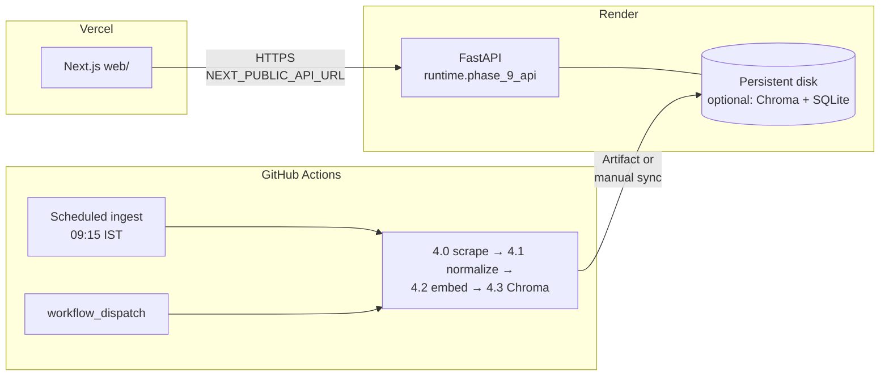

# Deployment plan

This document describes how to run the Mutual Fund FAQ assistant in production using **GitHub Actions** for scheduled ingest, **Render** for the FastAPI backend, and **Vercel** for the Next.js frontend. It aligns with [rag-architecture.md](./rag-architecture.md) (ingest §4, runtime §5–9).

---

## 1. Target architecture

| Piece | Role |
|--------|------|
| **GitHub Actions** | Authoritative **scheduler**: daily full ingest, optional manual run. Produces `data/chroma/` (and raw/normalized/chunked) as **artifacts** (see [.github/workflows/ingest.yml](../.github/workflows/ingest.yml)). |
| **Render** | **Query-time** API: `python -m runtime.phase_9_api` (uvicorn). Needs `GROQ_API_KEY`, on-disk **Chroma** path (`INGEST_CHROMA_DIR`), and optional durable **SQLite** threads (`THREAD_BACKEND=sqlite`). |
| **Vercel** | Static + SSR **Next.js** app in [`web/`](../web/). Browser calls the Render API using **`NEXT_PUBLIC_API_URL`** (must be the **public** Render URL, set at **build** time). |

---

## 2. Prerequisites

- GitHub repository with Actions enabled and (for scrape) optional secret **`INGEST_USER_AGENT`** ([ingest README](../ingest/README.md)).
- **Render** account; **Vercel** account linked to the same Git repo (or import `web/` via monorepo root with `web` as project root).
- **Groq** API key for generation ([.env.example](../.env.example)).
- A strategy for **Chroma on Render** (see §5.2): default Render filesystem is **ephemeral**; the vector index must survive restarts for production RAG.

---

## 3. GitHub Actions (scheduler)

**Workflow:** [.github/workflows/ingest.yml](../.github/workflows/ingest.yml)

| Item | Detail |
|------|--------|
| **Schedule** | `cron: 45 3 * * *` UTC ≈ **09:15 IST** (no DST in India). |
| **Manual run** | Actions → workflow → **Run workflow**. |
| **Steps** | Install deps → phase **4.0** scrape → **4.1** normalize → **4.2** chunk + embed → **4.3** Chroma upsert → **prune** old run dirs → upload **artifacts** (`data/raw`, `data/normalized`, `data/chunked`, `data/chroma`). |
| **Secrets (optional)** | `INGEST_USER_AGENT` — identifies scraper to origin sites. |
| **Vars (optional)** | Repository **variable** `INGEST_RATE_LIMIT_SECONDS` (passed into phase 4.0 in the workflow). |

**Operational note:** CI runners do **not** push the index into Render automatically. After a successful ingest you either **download the `ingest-chroma-*` artifact** and deploy it to Render’s disk, or add a **custom step** (e.g. upload to object storage + Render deploy hook) in a later iteration.

---

## 4. Vercel (frontend)

| Item | Detail |
|------|--------|
| **Project root** | Set Vercel **Root Directory** to **`web`** (monorepo). |
| **Framework** | Next.js (Node **≥ 20.9** per [`web/package.json`](../web/package.json)). |
| **Build command** | `npm run build` (default). |
| **Output** | Next default (App Router / `next build`). |
| **Environment variables** | **`NEXT_PUBLIC_API_URL`** = full origin of the Render API, e.g. `https://mf-faq-api.onrender.com` (**no** trailing slash required if your client already normalizes; use the exact URL your API serves). Must be set for **Production** and **Preview** if previews should hit a real API (often a separate Render **staging** service URL). |
| **Redeploy** | After changing `NEXT_PUBLIC_API_URL`, trigger a **new deployment** (value is inlined at build time). |

**CORS:** The API currently allows **`allow_origins=["*"]`** in [`runtime/phase_9_api/app.py`](../runtime/phase_9_api/app.py), so Vercel origins work without extra backend config. For stricter security later, replace with an explicit list of Vercel production and preview URLs.

**Health:** Smoke-test the deployed UI; API health check: `GET {NEXT_PUBLIC_API_URL}/health`.

---

## 5. Render (backend)

### 5.1 Service shape

| Item | Recommendation |
|------|----------------|
| **Service type** | **Web Service** (always-on or autoscale; note cold starts on free tier). |
| **Runtime** | **Python 3.12** (match CI and local `.venv`). |
| **Build command** | `pip install -r requirements.txt` |
| **Start command** | `python -m runtime.phase_9_api` |

### 5.2 Listen address and port

Render injects **`PORT`**. The app reads it in [`runtime/phase_9_api/config.py`](../runtime/phase_9_api/config.py). Set:

| Variable | Value |
|----------|--------|
| **`PORT`** | Set by Render (do not override manually). |
| **`API_HOST`** | **`0.0.0.0`** — required so the process accepts external connections (default `127.0.0.1` is only for local dev). |

### 5.3 Required and optional environment variables

Set these in the Render **Environment** tab (mirror [.env.example](../.env.example)):

| Variable | Required | Purpose |
|----------|----------|---------|
| **`GROQ_API_KEY`** | Yes | LLM generation (phase 6). |
| **`API_HOST`** | Yes (prod) | `0.0.0.0` |
| **`INGEST_CHROMA_DIR`** | Yes (prod) | Absolute path to Chroma persist dir on the instance, e.g. `/var/data/chroma` if using a **persistent disk** mounted there. |
| **`INGEST_CHROMA_COLLECTION`** | Optional | Default `mf_faq_chunks`. |
| **`THREAD_BACKEND`** | Recommended | `sqlite` for durable threads across restarts. |
| **`THREAD_DB_PATH`** | If sqlite | Absolute path on persistent disk, e.g. `/var/data/threads/threads.sqlite3`. |
| **`INGEST_REPO_ROOT`** | If needed | Repo root so relative defaults resolve when cwd differs. |
| **`RUNTIME_API_DEBUG`** | Optional | `0` in production (omit `debug` payloads). |
| **`ADMIN_REINDEX_SECRET`** | Optional | Enables `POST /admin/reindex` when set (currently **501** stub — safe to omit until implemented). |
| **`EDUCATIONAL_URL`** | Optional | Refusal educational link (default in code / docs). |
| **`GROQ_MODEL`**, **`GROQ_TEMPERATURE`** | Optional | Override defaults. |

### 5.4 Persistent disk (strongly recommended)

Without a **persistent disk**, `data/chroma` and SQLite thread DB are **lost on redeploy/restart**.

1. In Render: add a **disk**, mount e.g. **`/var/data`**.
2. Set `INGEST_CHROMA_DIR=/var/data/chroma` and ensure that directory contains the **`chroma.sqlite3`** (and related Chroma files) from your latest successful ingest artifact.
3. First-time bootstrap: unzip the **`ingest-chroma-*`** artifact from GitHub Actions into that path, then restart the service (or automate with a one-off shell job).

**Thread store:** Use `THREAD_BACKEND=sqlite` and `THREAD_DB_PATH` under the same mount so conversations survive restarts.

### 5.5 Health check

Configure Render **Health Check Path** to **`/health`** (JSON 200 from [`GET /health`](../runtime/phase_9_api/app.py)).

---

## 6. End-to-end rollout checklist

1. **Confirm ingest in CI** — Run the ingest workflow manually; verify artifacts include **`data/chroma/`** with expected size.
2. **Provision Render** — Create Web Service, set env vars (`API_HOST=0.0.0.0`, `GROQ_API_KEY`, `INGEST_CHROMA_DIR`, sqlite paths).
3. **Seed Chroma** — Copy latest Chroma persist directory from CI artifact onto Render disk; restart.
4. **Smoke-test API** — `curl https://<render-host>/health` and one `POST /threads` + `POST .../messages` flow.
5. **Provision Vercel** — Root `web/`, set **`NEXT_PUBLIC_API_URL`** to the Render URL; deploy production.
6. **Browser test** — Open Vercel URL; send a factual question; confirm citation + footer behavior.
7. **Ongoing ingest** — On each scheduled (or manual) ingest, **refresh** the Chroma files on Render (script, disk snapshot, or future object-storage pipeline).

---

## 7. Security and compliance (short)

- Do **not** commit `.env` or Groq keys; use platform secret stores only.
- Treat **`NEXT_PUBLIC_*`** as public: never put secrets there.
- Tighten **CORS** from `*` to explicit Vercel domains when you are ready.
- Logs: avoid enabling verbose **`RUNTIME_API_DEBUG`** in production if responses could include internal metadata ([rag-architecture.md](./rag-architecture.md) §9.2).

---

## 8. Known gaps and follow-ups

| Gap | Suggestion |
|-----|------------|
| **GHA → Render sync** | Not automated in-repo today; add a small release job (e.g. upload Chroma to R2/S3 + Render **pre-deploy** download) or Render **Deploy Hook** triggered after artifact upload. |
| **Single region** | Render + Vercel regions may differ; acceptable for FAQ latency until you optimize. |
| **Staging** | Duplicate Render service + Vercel **Preview** env with a staging API URL. |

---

## 9. Reference docs

- [rag-architecture.md](./rag-architecture.md) — system design, phases, Chroma path.
- [ingest/README.md](../ingest/README.md) — local ingest, env vars, prune behavior.
- [web/README.md](../web/README.md) — Next.js dev and `NEXT_PUBLIC_API_URL`.
