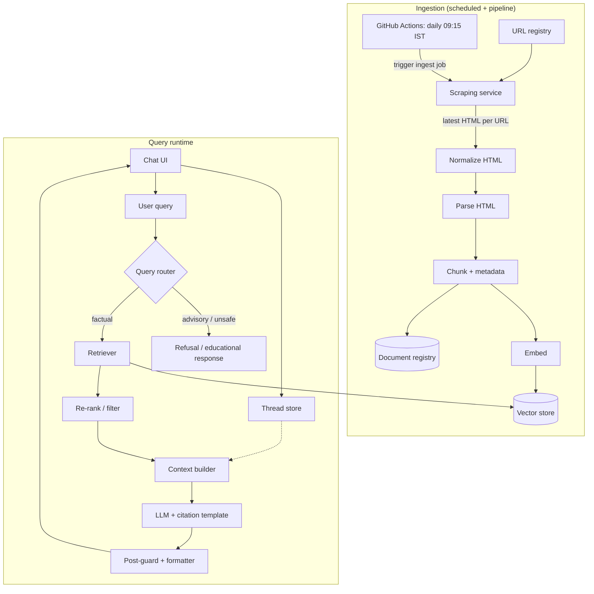

# RAG Architecture: Mutual Fund FAQ Assistant

This document describes a retrieval-augmented generation (RAG) architecture for the **facts-only mutual fund FAQ assistant** defined in [problemStatement.md](./problemStatement.md). It prioritizes **accuracy, provenance, and compliance** over open-ended conversational ability.

---

## 1. Design Principles

| Principle | Implication for architecture |
|-----------|------------------------------|
| Facts-only | Retrieval gates what the model may say; prompts and post-checks forbid advice and comparisons. |
| Single canonical source per answer | Retrieval returns chunks tagged with one citation URL; generation is constrained to cite that URL only. |
| Curated corpus | Ingestion is batch or scheduled from an allowlist of URLs; no arbitrary web crawling at query time. |
| No PII | No user document upload path; chat payloads exclude identifiers; logs redact or omit sensitive fields. |
| Accuracy over “intelligence” | Prefer abstention, refusal, or “see the indexed scheme page” over speculative answers. |

---

## 2. High-Level System Architecture

**Components in brief:**

- **Scheduler (GitHub Actions)**: A repository workflow runs on a **cron schedule** once per day at **09:15 IST** (`Asia/Kolkata`) to execute the full ingest job so the index reflects the **latest** scraped HTML from the allowlisted URLs. See §4.0 for workflow details, secrets, and manual `workflow_dispatch`.
- **Scraping service**: On each triggered run, reads the **URL registry**, **fetches** every allowlisted page (HTTP(S), rate-limited, identifiable user-agent), persists raw HTML for audit/replay, and passes content into **normalize → chunk → embed → index**. It does not crawl beyond the registry.
- **Ingestion pipeline**: Builds and refreshes the vector index and a parallel **document registry** (human-readable list of sources, fetch dates, scheme/AMC tags).
- **Thread store**: Persists conversation history per thread for multi-chat support without mixing contexts across users/sessions.
- **Query router**: Classifies intent (factual FAQ vs advisory vs out-of-scope) before retrieval.
- **Retriever + re-ranker**: Pulls top-k chunks from the vector store, then filters or re-ranks by scheme match, recency, and source type (e.g., Groww scheme page).
- **LLM layer**: Generates a short answer **only** from retrieved text, with a fixed output schema (sentences + one link + footer date).
- **Post-guards**: Validate citation presence, sentence count, and forbidden patterns (advice, “better/worse”, return promises).

---

## 3. Corpus & Data Model

### 3.1 Scope (current corpus)

**AMC:** HDFC Mutual Fund.

**Allowlisted URLs (HTML only; no PDFs in this phase):** each URL is a Groww mutual fund scheme page used as the sole indexed source for that scheme.

| Scheme (illustrative) | URL |
|------------------------|-----|
| HDFC Mid Cap Fund Direct Growth | https://groww.in/mutual-funds/hdfc-mid-cap-fund-direct-growth |
| HDFC Equity Fund Direct Growth | https://groww.in/mutual-funds/hdfc-equity-fund-direct-growth |
| HDFC Focused Fund Direct Growth | https://groww.in/mutual-funds/hdfc-focused-fund-direct-growth |
| HDFC ELSS Tax Saver Fund Direct Plan Growth | https://groww.in/mutual-funds/hdfc-elss-tax-saver-fund-direct-plan-growth |
| HDFC Large Cap Fund Direct Growth | https://groww.in/mutual-funds/hdfc-large-cap-fund-direct-growth |

**Out of scope for now:** AMC PDFs (KIM, SID), standalone factsheet PDFs, AMFI/SEBI pages, and additional URLs. The ingestion pipeline should be built so PDFs and extra allowlist entries can be added later without redesign.

**Note:** The [problem statement](./problemStatement.md) targets official AMC / AMFI / SEBI sources. This phase uses Groww pages as the curated HTML corpus; expanding to primary documents is a future corpus upgrade.

### 3.2 Document metadata (per chunk)

Store at minimum:

| Field | Purpose |
|-------|---------|
| `source_url` | Canonical URL for citation (exactly one per assistant message). |
| `source_type` | e.g., `groww_scheme_page` (current); later `factsheet`, `kim`, `sid`, `amfi`, `sebi` if the corpus expands |
| `scheme_id` / `scheme_name` | Tie chunks to a scheme when applicable; `null` for generic regulatory pages. |
| `amc` | AMC identifier or name. |
| `title` | Page or section title for debugging and UI tooltips. |
| `fetched_at` | ISO date for “Last updated from sources” (can be corpus max date or per-source). |
| `content_hash` | Detect content drift on re-crawl. |

### 3.3 Chunking strategy

- **HTML (Groww scheme pages):** Split on headings and logical sections; preserve tables as single units where possible (or row-groups for very large tables) so expense ratio / exit load rows stay intact. Rendered tables in HTML remain the primary place for numeric facts until PDFs are ingested.
- **PDF:** Not used in the initial corpus; when added later, use page- or section-aware chunking and avoid splitting mid-table when detectable.
- **Target chunk size:** Roughly 300–450 tokens (tuned for **`BAAI/bge-small-en-v1.5`**, max 512 input tokens), with **overlap** (e.g., 10–15%) to preserve boundary context.
- **De-duplication:** Same URL + overlapping hash → keep one primary chunk or merge metadata.

For **implementation-level** chunking and embedding (pipelines, token counting, batches, idempotency, vector payload), see **[chunking-embedding-architecture.md](./chunking-embedding-architecture.md)**.

### 3.4 Structured fund metrics (NAV, SIP, AUM, expense ratio, rating)

The assistant needs **reliable, queryable** values for a small set of fields (e.g. **NAV**, **minimum SIP**, **fund size**, **expense ratio**, **rating**). Those should **not** live only inside embedding chunks: dense retrieval can return the wrong span or a stale phrasing. Use a **hybrid**:

| Layer | What it stores | Role |
|-------|----------------|------|
| **Structured “facts” store** | One record per scheme per scrape run (or latest snapshot) with typed or labeled fields | Exact answers, filters, “last value we saw”, easy regression tests |
| **Vector index** (chunks) | Full normalized text / tables from the same page | Narrative context, exit load, benchmark, objectives, anything not modeled as columns |

**Where to persist (implementation path)**

1. **Near-term (file-based, next to raw HTML):** After each ingest run, write e.g. `data/structured/<run_id>/scheme_facts.json` (or `.jsonl` one object per scheme). Commit is optional; production can upload the artifact next to `data/raw/` or sync to object storage.
2. **Production:** Load the same schema into **Postgres** (row per `scheme_id` + `fetched_at`, or **upsert** “current” row per scheme) or a **document** store. Keep **`source_url`** and **`fetched_at`** on every record for citations and the “Last updated from sources” footer.

**Recommended logical schema (per scheme, per snapshot)**

| Field | Storage notes |
|-------|----------------|
| `scheme_id`, `scheme_name`, `amc` | From URL registry; stable keys. |
| `source_url` | Groww page URL (citation). |
| `fetched_at` | ISO timestamp of scrape. |
| `raw_content_hash` | Hash of raw HTML used for extraction (traceability). |
| `nav` | Number + currency (e.g. INR) + optional `as_of` date if present on page. |
| `minimum_sip` | Number (INR) + frequency if stated (e.g. monthly). |
| `fund_size` / `aum` | Number + unit (e.g. `₹ Cr` or raw string + parsed numeric). |
| `expense_ratio` | Percentage as number (e.g. `0.52` for 0.52% p.a.) + label (Direct/Regular) if applicable. |
| `rating` | **Store the raw label** from the page (e.g. “5”, “4★”, “Very High risk”) and a **`rating_kind`** enum: `riskometer` \| `analyst` \| `unknown` — Groww pages mix **risk** wording with other ratings; do not collapse unlike concepts. |

Use **`null`** for any field missing after parse; log parse warnings. Do not invent values.

**Extraction**

- Run as part of **normalize** (phase 4.1) or immediately after scrape: parse server-rendered HTML (Groww often embeds copy and may expose data in `__NEXT_DATA__` / JSON blobs). If critical fields are only available after client JS, document **headless fetch** as a follow-up; until then, structured store reflects **what the static HTML contained**.

**Query-time use**

- For questions that map cleanly to a column (“What is the minimum SIP?”), the app can answer from the **structured row** (still **one citation**: `source_url`) and optionally **skip** chunk retrieval for that turn, or **merge** chunk context with structured facts in the prompt builder.

---

## 4. Ingestion Pipeline (Detailed)

### 4.0 Scheduler and scraping service

**Scheduler — GitHub Actions**

- **Product default:** Run **every day at 09:15 IST** (`Asia/Kolkata`).
- **Cron in workflows:** GitHub Actions `schedule` uses **UTC**. For **09:15 IST** use **`45 3 * * *`** (03:45 UTC ≈ 09:15 IST). Re-verify after daylight-saving assumptions (India has no DST; UTC offset is fixed).
- **Workflow responsibilities:** The scheduled job in **[`.github/workflows/ingest.yml`](../.github/workflows/ingest.yml)** checks out the repo, installs dependencies, and runs **in order**: **4.0 scrape** → **4.1 normalize** → **4.2 chunk + embed** (local `BAAI/bge-small-en-v1.5`) → **4.3 upsert to on-disk Chroma** under `data/chroma/` (same `run_id` throughout; each phase picks the latest directory from the previous stage, which on a clean runner is the run just produced). See [chunking-embedding-architecture.md](./chunking-embedding-architecture.md) for chunk/embed details.
- **Secrets:** Embedding uses **local** `BAAI/bge-small-en-v1.5` (no API key). **Chroma:** vectors live in a **local persist directory** (`chromadb.PersistentClient`, default **`data/chroma/`**) — no hosted vector API. Phase 4.3 and the runtime retriever use the **same** `INGEST_CHROMA_DIR` / `INGEST_CHROMA_COLLECTION` settings. The workflow uploads **`data/chroma/`** as an artifact for operators or deploy steps. Optional: **`INGEST_USER_AGENT`** for scraping via `${{ secrets.* }}`. Never commit `.env` with production keys.
- **Runners:** Default `ubuntu-latest` is sufficient if the job is I/O and API-bound; pin a Python/Node version explicitly in the workflow.
- **Timeouts / billing:** Set `timeout-minutes` on the job (e.g. 30–60) so a hung scrape does not consume quota indefinitely.
- **Idempotency:** Workflows may be retried; ingest should be safe to re-run (`content_hash` / upsert semantics). Use **at-least-once** semantics.
- **Manual runs:** Enable **`workflow_dispatch`** on the same workflow so operators can trigger a full ingest from the Actions tab without waiting for the cron.
- **Artifacts (optional):** Upload scrape logs or a small manifest (URL → status) as a workflow artifact for debugging failed runs.
- **Alternative triggers:** `POST /admin/reindex` or a CLI on your app host can still call the **same** ingest code path; GitHub Actions remains the **primary** scheduled driver.

**Scraping service**

- **Input:** URL registry (allowlist only).
- **Behavior:** For each URL, perform an HTTP(S) **GET** (or the minimal requests needed if the site uses client-rendered data—then document whether headless fetch is required). Respect `robots.txt`, **rate limits** between requests, and use a **stable User-Agent** string identifying the assistant project.
- **Output:** Raw HTML (per URL, per run) written to durable storage (object store or disk) with a timestamp; forward the same payload to the **normalize** stage. On non-2xx responses, time-outs, or empty body: log, mark failure for that URL, and continue with other URLs (see §4.2).
- **Scope:** This component is **not** a general-purpose crawler: it only retrieves URLs explicitly listed in the registry. Query-time retrieval never calls the live web.
- **Separation:** Can be deployed as a library invoked by the scheduler worker, or as an internal HTTP endpoint `POST /internal/scrape-and-ingest` called by the scheduler; either way, **scheduler → scrape → rest of pipeline** is the contract.

### 4.1 Stages

1. **URL registry**  
   - Versioned list (YAML/JSON) of allowed URLs with tags: AMC, scheme, document type.

2. **Fetch (scraping service)**  
   - Executed on each scheduled (or manual) run; see §4.0.  
   - Store raw HTML (and later PDF bytes if the corpus expands) in object storage or disk for reproducibility.

3. **Normalize**  
   - HTML: strip boilerplate (nav, footers) where safe; keep main content.  
   - PDF: not in scope initially; add text extraction (and optional OCR only if required and licensed) when PDFs join the allowlist.

4. **Chunk + enrich**  
   - Apply chunking rules; attach metadata above.

5. **Embed**  
   - Embed with **`BAAI/bge-small-en-v1.5`** (local inference via sentence-transformers, 384-dim); same model at index build and query time.

6. **Index (phase 4.3 — local Chroma)**  
   - Upsert vectors and metadata into **on-disk Chroma** via `PersistentClient` (see **§4.3** below). Same embedding dimension as ingest (**384** for `bge-small-en-v1.5`).

7. **Refresh**  
   - **Primary:** Daily at **09:15 IST** via the **GitHub Actions** scheduled workflow (§4.0); bump `fetched_at` and re-embed changed chunks when `content_hash` differs.  
   - **Secondary:** `workflow_dispatch` on that workflow, or optional `POST /admin/reindex` / CLI for hotfixes.

### 4.2 Failure handling

- Failed URL: log, alert, exclude from index until fixed; do not silently substitute off-allowlist sources.
- Partial or empty HTML parse: mark document quality flag; optionally exclude low-confidence chunks from retrieval. When PDFs exist later, apply the same pattern to PDF extraction quality.

### 4.3 Phase: Vector index — local Chroma (`PersistentClient`)

**Product choice:** Use **Chroma** for dense retrieval with **`chromadb.PersistentClient`**: vectors and metadata live under a **single directory on disk** (default **`data/chroma/`**, configurable via `INGEST_CHROMA_DIR`). Ingest (phase 4.3) and the app’s retriever (§5) read the **same** path — no separate hosted vector service.

**Ingest-time steps (ordered)**

1. **Client & path**  
   - **`PersistentClient(path=...)`** pointing at `INGEST_CHROMA_DIR` (created if missing). Same pattern in CI and on a developer laptop.

2. **Collection**  
   - One logical **collection** per deployment (e.g. `mf_faq_chunks`), or per environment (`mf_faq_dev` / `mf_faq_prod`) via `INGEST_CHROMA_COLLECTION`, created with `get_or_create_collection`.  
   - **Dimension:** **384** (must match `BAAI/bge-small-en-v1.5`). **Distance:** cosine (or equivalent for L2-normalized BGE vectors per collection settings).

3. **Record shape (align with [chunking-embedding-architecture.md](./chunking-embedding-architecture.md) §5)**  
   - **id:** `chunk_id` (deterministic hash — idempotent upserts).  
   - **embedding:** float vector length 384.  
   - **document:** `chunk_text` (retrieval display + LLM context).  
   - **metadata (filterable):** `source_url`, `scheme_id`, `scheme_name`, `amc`, `source_type`, `fetched_at`, `chunk_index`, `section_title` (optional), `run_id` or `normalized_text_hash` (optional, for debugging / purge-by-run).

4. **Upsert strategy**  
   - For each daily ingest run: **upsert** by `chunk_id` (add new, update changed embeddings/metadata) into the local collection.  
   - If **`chunk_text_hash`** unchanged vs previous manifest, optional optimization: skip that Chroma write (same as §4.4 incremental embed in chunking doc).

5. **Deletion / stale data**  
   - If a scheme is **removed** from the URL registry, **delete** all collection entries whose `scheme_id` (or `source_url`) matches the removed scheme (same API as local Chroma).  
   - Alternatively **replace collection** on full reindex for small corpora.

6. **Registry / operator manifest**  
   - Emit a small **index manifest** (JSON) per run: `embedding_model_id`, `run_id`, `collection_name`, **`chroma_persist_path`**, `chunk_count`, `updated_at`, `indexed_at` — so operators know which directory the app must mount or copy at deploy time. Store as a **workflow artifact** next to chunked outputs; upload **`data/chroma/`** as its own artifact for convenience.

7. **CI (GitHub Actions)**  
   - After phase 4.2: run phase **4.3** with no vector API keys. The runner writes under **`data/chroma/`**; upload that directory (and chunked JSONL) as artifacts. For production hosts, **sync or mount** that directory (or rebuild index on the server with the same CLI).

**Query-time (runtime API — future wiring)**  
- Use the same **`PersistentClient`** path (or a read-only copy of the same files) as ingest.  
- Embed user query with the same **BGE** model and **query prefix** (`Represent this sentence: `) per chunking doc.  
- `collection.query(query_embeddings=[...], n_results=k, where={...})` with optional **`where`** on `scheme_id` / `amc` when the router resolves a scheme.  
- Pass retrieved `documents` + metadata `source_url` into the LLM context packager (§6).

---

## 5. Retrieval Layer

**Implementation (code):** [`runtime/phase_5_retrieval/`](../runtime/phase_5_retrieval/) — BGE query embedding, Chroma `query` against the on-disk store, merge by `source_url`, primary `citation_url` for §6. CLI: `python -m runtime.phase_5_retrieval "…"`.

### 5.1 Query preprocessing

- **Light normalization**: lowercase for matching; keep scheme names and tickers as entities (optional NER or dictionary match against known scheme list).
- **Scheme resolution**: If the user names a scheme, constrain metadata filter `scheme_id` when confidence is high; otherwise retrieve broadly then re-rank.

### 5.2 Retrieval mechanics

1. **Dense retrieval**: Top-`k` (e.g., 20–40) by cosine similarity in vector store.  
2. **Metadata filter**: Optional pre-filter by `scheme_id` or `amc` when resolved.  
3. **Re-ranking** (recommended): Cross-encoder or lightweight lexical re-rank on candidate chunks to improve table/number-heavy FAQ hits.  
4. **Merging**: If multiple chunks from the **same** `source_url` score highly, merge text for context while keeping **one** citation URL.

### 5.3 Source selection for “exactly one link”

- **Primary rule**: Choose the **single highest-confidence chunk’s** `source_url` as the citation for the reply.  
- **Conflict rule**: If chunks disagree (rare after curation), prefer the **newer `fetched_at`** snapshot, or respond conservatively: point to the scheme’s allowlisted page URL without reconciling numbers in free text (optional policy: refuse numeric answer if conflict detected).

### 5.4 Performance-related questions

Per constraints: do **not** compute or compare returns; answer with a **link to the indexed scheme page** (one of the allowlisted URLs) only, plus minimal process language if present in corpus.

---

## 6. Generation Layer

**Implementation (code):** [`runtime/phase_6_generation/`](../runtime/phase_6_generation/) — packs CONTEXT with `Source URL:` headers (§6.1), calls **[Groq](https://groq.com/)** chat completions with JSON `body` / `citation_url` / `footer`, then runs §7.2-style validation (allowlist URL, ≤3 sentences, forbidden phrases) with one retry and a templated fallback. CLI: `python -m runtime.phase_6_generation "…"`.

### 6.1 Prompting strategy

- **System prompt**: Enforce facts-only, no recommendations, no comparisons, ≤3 sentences, exactly one markdown or plain URL from provided metadata, and the required footer line.  
- **Developer / tool instructions**: “Use only the CONTEXT; if CONTEXT is insufficient, say you cannot find it in the indexed sources and suggest the relevant allowlisted scheme URL from metadata if available.”  
- **Context packaging**: Pass retrieved chunk text with explicit `Source URL: ...` headers so the model does not invent links.

### 6.2 Output schema (contract)

1. **Body**: ≤ 3 sentences, factual, no “you should invest”.  
2. **Citation**: Exactly one URL, matching the selected `source_url`.  
3. **Footer**: `Last updated from sources: <date>` using corpus or cited document `fetched_at` (policy: max date across chunks used, or date of cited source only—pick one and document in README).

### 6.3 Model choice (conceptual)

- Prefer a **smaller, instruction-tuned** model with low temperature for determinism, **or** a larger model with strong instruction following if budget allows.  
- Embedding model (`BAAI/bge-small-en-v1.5`, local) and LLM (API) need not share a provider.

---

## 7. Refusal & Safety Layer

**Implementation (code):** [`runtime/phase_7_safety/`](../runtime/phase_7_safety/) — rule-based **router** before retrieval (§7.1), templated refusal + configurable **educational URL** (`EDUCATIONAL_URL`, default AMFI investor education), **§7.3** PII heuristics + log redaction, and `answer()` orchestrating phases 5→6 when allowed. CLI: `python -m runtime.phase_7_safety "…"`, `python -m runtime.phase_7_safety --route-only "…"`.

### 7.1 Advisory / comparative queries

**Router** (can be rules + lightweight classifier or LLM-with-structured-output):

- Detect: “should I”, “which is better”, “best fund”, “recommend”, implicit ranking, personal situation (“I am 45…”).  
- **Action**: No retrieval **or** retrieval only for a static **educational** snippet from allowlisted AMFI/SEBI URLs (pre-approved chunk).  
- **Response**: Polite refusal + **one** educational link (AMFI/SEBI), no scheme-specific advice.

### 7.2 Post-generation validation

Programmatic checks:

- Sentence count ≤ 3 (heuristic: `.` `?` `!` count or NLP sentence splitter).  
- Exactly one HTTP(S) URL present and on allowlist.  
- Forbidden regex / keyword lists: “invest in”, “you should”, “better than”, “outperform”, “guarantee”, etc.  
- On failure: regenerate once with stricter prompt, or fall back to templated safe response with the scheme’s allowlisted URL.

### 7.3 Privacy

- Do not request or store PAN, Aadhaar, account numbers, OTPs, email, phone.  
- If the UI ever supports “paste your statement text”, **out of scope** for this product as specified—do not implement unless requirements change.

---

## 8. Multi-Thread Chat Architecture

### 8.1 Thread model

- **Thread ID**: Opaque identifier per conversation (UUID).  
- **Ownership**: Associate threads with anonymous session or optional non-PII session key only.  
- **Storage**: Each message `{ role, content, timestamp, optional retrieval_debug_id }`.

### 8.2 Context window policy

- For factual FAQ, **full thread history** is often unnecessary; use last **N** turns (e.g., 4–6) for follow-ups (“What about exit load?”).  
- **Retrieval query expansion**: Optionally rewrite the latest user message using recent history (e.g., “same scheme as before”) via a small model or template—**without** injecting PII.

### 8.3 Concurrency

- Stateless API servers; thread state in DB or durable KV.  
- Vector store read-only at query time; no cross-thread writes.

### 8.4 UI mapping

- Thread list + active thread; switching threads loads that thread’s messages only.

**Implementation (code):** [`runtime/phase_8_threads/`](../runtime/phase_8_threads/) — SQLite thread/message store (§8.3; swap for Postgres in production per §11), opaque UUID thread ids, optional `session_key`, rows `{ role, content, timestamp, retrieval_debug_id }`, last-**N**-turn window via `THREAD_MAX_TURNS`, optional §8.2 retrieval query expansion from prior **user** lines only (no assistant echo), `post_user_message()` → phase **7** `answer()`. CLI: `python -m runtime.phase_8_threads new-thread`, `say`, `history`, `context`, `list-threads`.

---

## 9. Application & API Layer (Suggested)

### 9.1 Endpoints (illustrative)

| Endpoint | Purpose |
|----------|---------|
| `POST /threads` | Create thread. |
| `GET /threads/{id}/messages` | List messages. |
| `POST /threads/{id}/messages` | User message → pipeline → assistant message. |
| `GET /health` | Liveness. |
| `POST /admin/reindex` | Protected re-ingestion trigger (optional). |

### 9.2 Response payload

- `assistant_message` (user-visible).  
- Optional `debug` (dev only): retrieved chunk IDs, scores—**disabled in production** for leakage/minimalism.

**Implementation (code):** [`runtime/phase_9_api/`](../runtime/phase_9_api/) — **FastAPI** + **uvicorn**: `GET /health`, `POST /threads`, `GET /threads`, `GET /threads/{id}/messages`, `POST /threads/{id}/messages` (→ phase 8 `post_user_message`), optional `POST /admin/reindex` (requires `ADMIN_REINDEX_SECRET`, returns **501** stub). `RUNTIME_API_DEBUG=1` adds `debug` on post-message (latency + generation metadata; chunk IDs when wired). **`GET /`** returns JSON pointers to docs and the **Next.js** UI in [`web/`](../web/) (`npm run dev`, `NEXT_PUBLIC_API_URL` → API origin). Run API: `python -m runtime.phase_9_api` (see `PORT` / `API_HOST` in `.env.example`).

---

## 10. Observability & Quality

### 10.1 Logging

- Log query latency, retrieval count, router decision, refusal vs answer.  
- **Do not** log full message bodies if policy tightens; at minimum aggregate metrics.

### 10.2 Evaluation (offline)

- Golden set of ~50–100 Q&A pairs from the corpus with expected **source URL** and allowed answer variants.  
- Metrics: citation URL exact match rate, grounding (answer supported by chunk), refusal precision/recall on advisory prompts.

### 10.3 Drift

- Re-crawl alerts when `content_hash` changes for critical allowlisted URLs (e.g., each Groww scheme page).

---

## 11. Technology stack

| Layer | Choice |
|-------|--------|
| Scheduled ingest | **GitHub Actions** (`schedule` + `workflow_dispatch`) |
| Vector DB | **Chroma** — phase **4.3** (`PersistentClient` on disk under `INGEST_CHROMA_DIR`; same path at query time in §5) |
| Embeddings | **`BAAI/bge-small-en-v1.5`** via `sentence-transformers` (local, 384-dim, 512 max tokens); upgrade to `bge-base-en-v1.5` (768-dim) when corpus grows |
| LLM | **Groq** chat API for phase 6 (`GROQ_API_KEY`; model e.g. `llama-3.1-8b-instant`) — independent of local BGE embeddings |
| Orchestration | LangChain/LlamaIndex or thin custom pipeline |
| UI | Next.js, Streamlit, or minimal static + API |
| Storage | Postgres for threads/messages; object store for raw fetches |

Keep **embedding model**, **chunking parameters**, and **Chroma collection dimension (384)** frozen across index and query for reproducibility.

---

## 12. Known Limitations (Architectural)

- **Stale data**: Answers reflect last crawl; financial fields change—footer date mitigates but does not eliminate staleness.  
- **HTML table / layout variance**: Numeric FAQs are sensitive to how Groww renders tables and labels; PDF ingestion later adds a separate extraction risk surface.  
- **Narrow corpus**: Only indexed schemes/pages are answerable; broad MF questions may need refusal + educational link.  
- **Router mistakes**: Misclassified advisory queries could leak tone; combine router + post-guards.  
- **No real-time market data**: By design.

---

## 13. Alignment with Deliverables

| Deliverable | Where it lives in this architecture |
|-------------|--------------------------------------|
| README setup, AMC/schemes, architecture, limitations | Operational docs + this file + [chunking-embedding-architecture.md](./chunking-embedding-architecture.md) (incl. phase 4.3 Chroma steps) + [runtime/phase_5_retrieval/](../runtime/phase_5_retrieval/) (§5) + [runtime/phase_6_generation/](../runtime/phase_6_generation/) (§6) + [runtime/phase_7_safety/](../runtime/phase_7_safety/) (§7) + [runtime/phase_8_threads/](../runtime/phase_8_threads/) (§8) + [runtime/phase_9_api/](../runtime/phase_9_api/) (§9). |
| Disclaimer snippet | UI + optional system prompt reinforcement. |
| Multi-thread chat | Section 8 + thread API in Section 9. |
| Facts-only + one citation + footer | Sections 5–7 and 6.2. |

---

## 14. Summary

The architecture is a **closed-book RAG system**: a **curated, versioned corpus** of allowlisted URLs (currently five Groww HDFC scheme pages, HTML only) is refreshed by a **GitHub Actions** schedule (**09:15 IST**) that runs scrape → normalize → **chunk → embed** (see [chunking-embedding-architecture.md](./chunking-embedding-architecture.md)) → **local Chroma** vector upsert under **`data/chroma/`** (**§4.3**); at query time, a **router** and **retriever** (same on-disk collection; similarity + metadata filters) constrain **what** may be said, and **prompts plus post-validation** enforce **how** it is said—short, factual, **one source link**, and compliant refusal paths for non-factual or advisory requests. **Multi-thread support** is handled by durable per-thread history and conservative use of that history for retrieval query expansion only.
